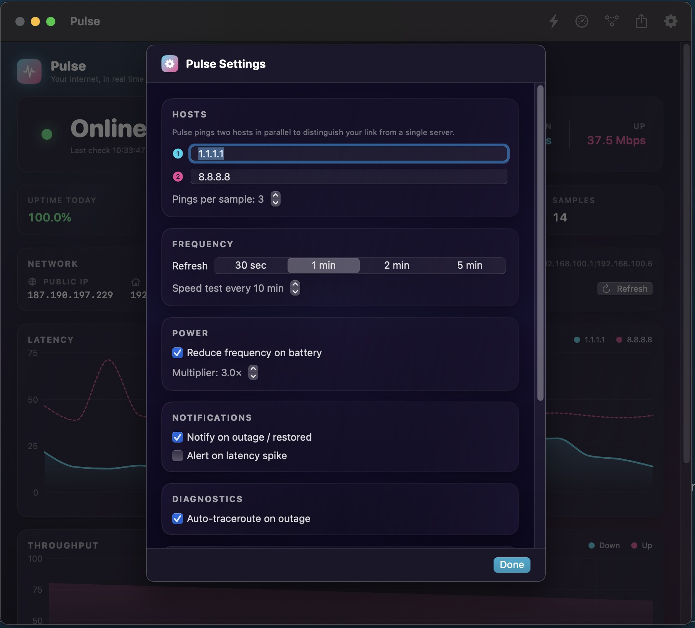

# Pulse

> Your internet, in real time. A native macOS network monitor that lives in your menu bar.

<p align="center">
  
</p>

<p align="center">
  
</p>

## What it does

Pulse continuously checks your connection (every 30s – 5m, your call) and gives you the truth about your internet — **right now** and **over time**:

- **Online / offline** with a live pulsing indicator
- **Latency, jitter, packet loss** to two hosts in parallel (default `1.1.1.1` and `8.8.8.8`)
- **Download / upload throughput** via macOS's built-in `networkQuality`
- **Outage log** — every drop is timestamped, durations tracked, with auto-traceroute captured at the moment things break
- **Network info** — public IP, local IP, gateway, interface, captive-portal detection
- **Menu bar status** — glanceable pulse icon + ms readout
- **Notifications** — outage start/restored, latency-spike alerts (configurable threshold)
- **Battery-aware** — cadence backs off automatically on battery
- **Shortcuts integration** — `Run Speed Test`, `Get Latest Ping`, `Check If Online`
- **CSV export** — proof-for-ISP report with every sample, outage and speed test

## Why I built it

Most Mac monitors are either pretty dashboards with no outage history (Stats, Bandwidth+), enterprise Windows-ports with hostile UI (PingPlotter), or aging Speedtest-by-Ookla which hasn't been updated in years. Pulse picks the best ideas from each, drops the bloat, and looks like something you actually want in your menu bar.

## Install

### Build from source

Requirements: macOS 13+ and Xcode (the Command Line Tools alone are missing the SwiftPM ManifestAPI).

```bash
git clone <this repo>
cd pulse
./build.sh
open Pulse.app
# Optional:
cp -R Pulse.app /Applications/
```

The build script:
1. Picks Xcode's toolchain via `DEVELOPER_DIR` (without changing global `xcode-select`)
2. Compiles the `Pulse` and `IconGen` Swift Package targets
3. Generates `AppIcon.icns` from a SwiftUI `ImageRenderer` view
4. Bundles `Pulse.app` and ad-hoc codesigns it

First launch may show macOS's "downloaded from internet" warning since the binary is ad-hoc signed — right-click → Open, then it remembers.

### Tip: launch at login

In Pulse's Settings sheet, toggle **Launch at login**. (Uses `SMAppService.mainApp`, no helper required.)

## Project layout

```
.
├── Package.swift                # Two SwiftPM targets: Pulse + IconGen
├── build.sh                     # Build + bundle + .icns pipeline
├── Sources/
│   ├── Pulse/
│   │   ├── PulseApp.swift          # @main, WindowGroup, MenuBarExtra
│   │   ├── ContentView.swift       # Main window
│   │   ├── MenuBarView.swift       # Menu bar dropdown
│   │   ├── SettingsView.swift      # Settings sheet
│   │   ├── TracerouteView.swift    # Traceroute viewer
│   │   ├── Theme.swift             # Brand: palette, gradients, PulseDot, MetricChip…
│   │   ├── NetworkMonitor.swift    # Ping cycle, speed test, outage tracking
│   │   ├── Models.swift            # PingSample / SpeedSample / OutageEvent / Settings
│   │   ├── Persistence.swift       # JSON in ~/Library/Application Support/Pulse/
│   │   ├── NetworkInfoProvider.swift  # Public IP, local IP, gateway, captive portal
│   │   ├── PowerMonitor.swift      # IOPowerSources (battery vs AC)
│   │   ├── Notifications.swift     # UNUserNotificationCenter
│   │   ├── LoginItem.swift         # SMAppService
│   │   ├── Traceroute.swift        # /usr/sbin/traceroute wrapper
│   │   └── AppIntents.swift        # Shortcuts: Get Ping / Check Online / Run Speed Test
│   └── IconGen/
│       └── main.swift              # SwiftUI view → PNGs (16…1024) → iconutil → .icns
└── docs/                          # GitHub Pages site
    ├── index.html
    ├── styles.css
    ├── script.js
    └── assets/
```

## Settings reference

| Setting | Default | What it does |
|---|---|---|
| Primary host | `1.1.1.1` | First ping target each cycle |
| Secondary host | `8.8.8.8` | Second target — distinguishes "your link" from "that one server" |
| Pings per sample | 3 | Used to compute jitter and packet loss |
| Refresh | 1 min | Cycle cadence: 30s / 1m / 2m / 5m |
| Speed test cadence | 10 min | `networkQuality` runs intentionally infrequently — it saturates the link for ~15s |
| Reduce frequency on battery | on | Multiplies refresh interval (default 3×) when on battery |
| Notify on outage / restored | on | macOS notification at the moment of state change |
| Latency-spike alert | off | Notify when ping > N ms (with 5-minute cooldown) |
| Auto-traceroute on outage | on | Captures `/usr/sbin/traceroute -n` at outage onset, attaches to outage record |
| Show ping in menu bar | on | Toggle the numeric readout next to the menu bar icon |
| Launch at login | off | Registers via `SMAppService.mainApp` |

## Where data lives

```
~/Library/Application Support/Pulse/
├── settings.json
├── history.json    # ping samples
├── speed.json      # speed test samples
└── outages.json    # outage events with traceroute attachments
```

7 days of rolling history are kept by default. Use **Settings → Show in Finder** to open this folder, or **Clear all history** to wipe it.

## Shortcuts integration

Three actions are exposed via App Intents:

- **Get Latest Ping** → returns ping in milliseconds
- **Check If Online** → returns Boolean
- **Run Speed Test** → triggers a fresh test, returns Mbps when done

Useful as Hot Keys, Stream Deck triggers, or scriptable status checks.

## CSV export

The toolbar **Export** button drops a CSV with three sections:
1. Per-host ping samples — timestamp, attempts, received, loss%, latency, jitter, min, max
2. Outages — start, end, duration, network fingerprint
3. Speed tests — timestamp, down Mbps, up Mbps, dl/ul responsiveness (RPM)

This is what you send to your ISP when they say "looks fine on our end."

## Tech

- **SwiftUI** (macOS 13+)
- **Swift Charts** for the latency / throughput visualisations
- **Swift Package Manager** — no Xcode project file needed
- **`SMAppService`** for login-item registration
- **`AppIntents`** for Shortcuts
- **No third-party dependencies**

Pulse is **\~1.1 MB** of binary (most of the bundle is the icon set).

## Roadmap

Things that didn't ship yet but would be nice:

- [ ] Lock Screen widget (macOS 14+)
- [ ] SSID / BSSID logging once Location permission is granted (per-Wi-Fi outage correlation)
- [ ] Continuous MTR-style traceroute view
- [ ] iCloud sync of history across Macs
- [ ] DNS health (resolution time over time, 1.1.1.1 vs 8.8.8.8 vs ISP)
- [ ] VPN on/off comparison (interface tagging on samples)
- [ ] ISP outage feed correlation (Downdetector / Cloudflare Radar)

## License

MIT — see `LICENSE`.

## Acknowledgments

Brand designed inline. App icon drawn procedurally with SwiftUI's `ImageRenderer` (no Sketch / Figma round-trip).
